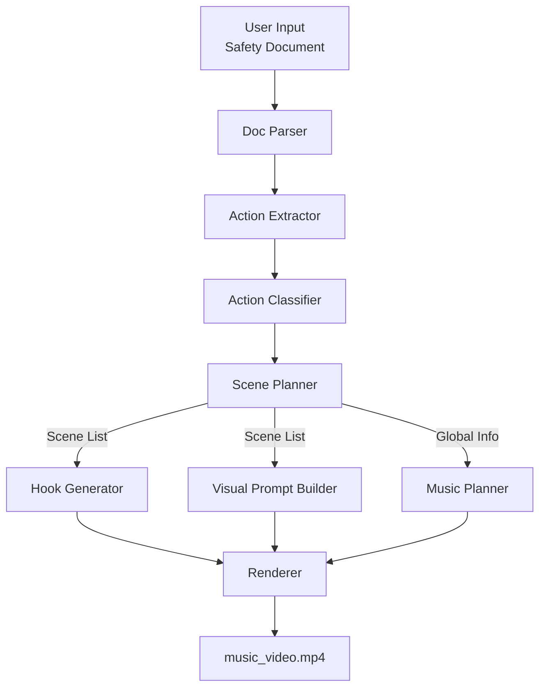

# 기획 한번 더! (SafetyMV)

<aside>
💡

안전관리 수칙 텍스트를 입력하면, 핵심 행동 규칙만 뽑아 **30~90초짜리 ‘뮤직비디오’ 안전 영상**을 자동 생성한다.

</aside>

# 문제 정의

- 안전문서는 길고 딱딱해서 잘 안 읽힌다.
- “알고 있다”와 “실제로 기억하고 행동한다”는 다르다.
- 반복 학습과 상황 재현이 중요한데, 문서 형식은 이를 지원하기 어렵다.

즉, 문제는 **정보 부족이 아니라 기억과 행동으로의 연결 실패**다.

# 해결방식

- 텍스트 규칙을 **리듬(음악) + 상황 컷(영상) + 훅(짧은 문장)**으로 변환해 기억을 강화한다.
- 문서의 핵심은 “규칙 문장”이 아니라 “행동 단위”이므로, 문서를 카드화하고 스토리로 재조합한다.
- 결과물은 단순 설명 영상이 아니라 **뮤직비디오처럼 몰입되는 안전 콘텐츠**다.

# 예시

## 📕 줄글 안전 문서 입력

```
지게차 안전수칙.pdf

 지게차를 운전하는 모든 작업자는 반드시 안전모와 안전화를 착용해야 한다. 지게차 작업 반경 내에는 작업자 외 인원이 출입하지 않도록 한다. 후진 주행 시에는 경고음을 울리고, 시야 확보가 되지 않을 경우 보조 유도자를 배치한다. 지게차에 화물을 적재할 경우, 허용 적재 중량을 초과해서는 안 되며, 화물은 반드시 고정한 상태에서 이동해야 한다. 작업 중 이상 소음이나 진동이 발생할 경우 즉시 작업을 중지하고 관리자를 호출한다.
```

## ✅ 컨셉 설정

- 길이: 60초
- 무드: Tense → Clear
- 장르: Hip-hop
- 스타일: K-webtoon 기반 일러스트

## 🎬 뮤직비디오 출력

- **0–5초 | Intro**
    - 화면: 어두운 물류창고 와이드샷
    - 자막(훅): “사고는 항상, 익숙한 순간에 온다”
- **5–12초 | Scene 1 — 보호구**
    - 화면: 작업자가 안전모를 쓰는 클로즈업 컷
    - 자막: “안전모는 선택이 아니다”
- **12–20초 | Scene 2 — 작업 반경**
    - 화면: 지게차 이동 중, 사람이 가까이 다가오는 순간 정지
    - 자막:“사람 보이면, 멈춰라”
- …

[요런 mv를 생각하면 되겠습니다.](https://www.youtube.com/watch?v=cK0pXGovQYo)

요런 mv를 생각하면 되겠습니다.

# 발표 시나리오

### **1️⃣ Problem**

**“이 문서, 솔직히 아무도 안 읽습니다.”**

- 안전 수칙은 있지만,
- 사고 순간에 **기억나지 않습니다**.

### **2️⃣ Input**

실제 현장에서 쓰는 **긴 안전 문서 그대로 입력**합니다.

(PDF / 텍스트)

### **3️⃣ Generate**

Generate 클릭 한 번. 문서를 읽는 대신,

- 핵심 **행동 규칙만 추출**
- 영상용으로 **재구성**

### **4️⃣ Process**

문서 분석 → 규칙 추출 → 씬 구성 → **씬 단위 병렬 생성**

(이미지 / 훅 / 음악)

> 한 번에 만드는 게 아니라나눠서, 실패해도 다시 만들 수 있게
> 

### **5️⃣ Output**

30–60초 **뮤직비디오형 안전 영상**

- 체크리스트 + 규칙 카드

**“재미로 끝나지 않고, 현장에 남는 결과물”**

# 부록

## 왜 멀티 에이전트로 해야 하는가? **— 토큰 · 안정성 · 정확도 관점에서**

### **토큰 관점: 절대적 우위라기보다는 조건부 이점**

단일 에이전트 접근은 보통 다음과 같이 동작한다.

> “이 안전 문서를 읽고 → 중요한 걸 뽑고 → 가사 만들고 → 장면 만들고 → 음악까지 설계해줘”
> 

이 방식은:

- 프롬프트가 길어질 수밖에 없고
- 문서 길이에 따라 토큰 사용량이 선형적으로 증가하며
- 결과가 마음에 들지 않을 경우 **전체를 다시 생성**해야 한다

멀티 에이전트 접근에서는 문서 분해, 행동 단위 추출, 씬 배치, 훅 생성, 이미지·음악 파라미터 결정을 각각의 단계로 분리한다.

이 구조에서는:

- 각 에이전트가 **짧은 입력과 출력**만 다루고
- 대부분의 작업이 *분류·선택·재배치*에 가깝다
- 자연어 생성은 훅처럼 **필요한 지점에서만 최소화**된다

다만, 에이전트 간 오케스트레이션 비용이 있기 때문에 **한 번에 완벽히 끝나는 경우**에는 단일 에이전트가 토큰 면에서 더 효율적일 수도 있다.

### **안정성 관점: 실패를 전제로 한 구조**

이 프로젝트의 핵심 전제는 **동영상 생성은 실패 가능성이 높은 작업**이라는 점이다.

- 특정 씬의 이미지 생성 실패
- 일부 규칙 누락
- 훅이나 장면이 어색해 재생성이 필요한 경우

단일 에이전트 구조에서는 이런 문제가 발생할 때마다

→ **전체 파이프라인을 다시 실행**해야 한다.

반면 멀티 에이전트 구조에서는:

- 실패한 단계만 재시도 가능하고
- 씬 단위 병렬 처리로 대기 시간을 줄일 수 있으며
- 재시도 단위가 작아 **누적 비용을 제어**할 수 있다

즉, 멀티 에이전트의 실질적인 이점은

> **“한 번에 싸게 끝내는 구조”**가 아니라 
**“여러 번 실패해도 감당 가능한 구조”**에 있다.
> 

### **정확도 관점: 안전 도메인에 맞는 책임 분리**

안전 수칙 도메인에서는 창의성보다 **누락 없는 전달과 일관성**이 더 중요하다.

멀티 에이전트 구조에서는:

- 각 단계의 책임이 명확하다
    
    (문서 해석, 행동 추출, 분류, 씬 배치, 표현)
    
- 특정 규칙이 영상에 포함되지 않았을 경우
    
    → 어느 단계에서 누락됐는지 추적 가능하다
    
- 규칙 추출과 표현 단계를 분리함으로써
    
    **의미 손실 없이 시각화**할 수 있다
    

단일 에이전트에서는 이러한 검증이 어렵고, 결과가 “그럴듯하지만 이유를 설명할 수 없는 상태”가 되기 쉽다.

**위 의견들 뒷받침할만한 논문들을 찾으면 좋을듯!** 논문이 있으면 피칭할 때 좋은 점수를 얻을 것 같아요.

## 멀티 에이전트 회로 예시

### 회로도



**Doc Parser**

- 입력: 원본 안전 문서
- 출력: 문장 단위 텍스트
- 책임: **문서를 다루기 쉬운 형태로 정리**

**Action Extractor**

- 입력: 문장
- 출력: 행동 단위 규칙
- 책임: **“규칙 문장” → “행동”으로 변환**

**Action Classifier**

- 입력: 행동
- 출력: 행동 타입 (착용 / 확인 / 금지 등)
- 책임: **행동을 고정된 카테고리로 분류**

**Scene Planner**

- 입력: 행동 리스트
- 출력: 씬 순서, 타이밍
- 책임: **영상의 전체 뼈대 설계**
- ⚠️ 이후 단계 병렬 처리의 기준점

**Hook Generator (씬별 병렬)**

- 입력: 씬 + 행동
- 출력: 짧은 훅 문장
- 책임: **기억에 남는 자막 생성**

**Visual Prompt Builder (씬별 병렬)**

- 입력: 씬 정보
- 출력: 이미지 생성 프롬프트
- 책임: **비주얼 일관성 유지**

**Music Planner (전역)**

- 입력: 영상 길이 / 무드
- 출력: 템포, 드롭 타이밍
- 책임: **전체 리듬 설계 (씬과 독립)**

**Renderer**

- 입력: 이미지, 음악, 자막
- 출력: 최종 영상
- 책임: **모든 결과물 합성**

## 최적화 포인트

### **씬 단위 병렬 처리**

- Scene Planner 이후:
    - **각 씬별 훅 생성**
    - **각 씬별 이미지 프롬프트 생성**
- 씬 수 = 병렬 작업 수

### **음악 설계의 독립성**

- 음악 길이 / 템포 / 드롭 타이밍은
    - 문서 전체 기준으로 한 번만 계산
- 씬 처리와 **완전히 병렬 가능**

### **실패 격리**

- 특정 씬 이미지 생성 실패
    - 해당 씬만 재시도
- 전체 파이프라인 재실행 ❌

(메모) 비디오 병렬 처리 시 고려할 점: 모든 결과물이 “동일한 맥락 (캐릭터, 배경)”을 가지도록 잘 조정해야 함.

## 필요한 화면 구성 (예시)

### **Screen 1 — Create Safety MV**

- 안전 문서 입력 (텍스트 / PDF)
- 옵션:
    - 영상 길이 (30 / 60 / 90)
    - 무드
    - 현장 유형
- 버튼:
    - **Generate**
    

### **Screen 2 — Generation Progress**

- 단계별 진행 카드
    - 문서 분석
    - 규칙 추출
    - 스토리 구성
    - 음악/이미지 생성
    - 렌더링
- 각 단계:
    - “예시 결과 미리보기” 토글

### **Screen 3 — Result**

- 뮤직비디오 플레이어 (자동 재생)
- 탭:
    - MV
    - Safety Cards
    - Checklist
- 다운로드 버튼

## 확장 가능성

- 학습 비디오 자동 생성 서비스로 확장 가능합니다.

[아기상어 IP 사용 + 구구단 내용이 들어가야 해! 이렇게 서비스에 넣으면 만들어줄듯.](https://www.youtube.com/watch?v=RjG5n_ymIHY)

아기상어 IP 사용 + 구구단 내용이 들어가야 해! 이렇게 서비스에 넣으면 만들어줄듯.

## Reference

- origin of 기획 : [https://chatgpt.com/share/6967612a-3720-8010-8a5b-350546283ca1](https://chatgpt.com/share/6967612a-3720-8010-8a5b-350546283ca1) (만료된듯)
    - 위에꺼 백업내용: [기획](https://www.notion.so/2e8b3ecbc1e580cd8aace13442b88d62?pvs=21)
- https://www.linkedin.com/posts/jyoung105_%EB%A9%80%ED%8B%B0-%EC%97%90%EC%9D%B4%EC%A0%84%ED%8A%B8-%EC%84%A4%EA%B3%84%ED%95%A0-%EB%95%8C-%EC%A7%84%EC%A7%9C-%EB%8F%84%EC%9B%80-%EB%90%90%EB%8D%98-%EA%B8%80-%ED%95%98%EB%82%98-%EC%9A%94%EC%A6%98-%ED%8C%80%EC%97%90%EC%84%9C-%EB%94%94%EC%9E%90%EC%9D%B8-ugcPost-7418412480252727296-i_W8/?utm_medium=ios_app&rcm=ACoAACLsdPcB2lXFibhESe271ADAO9OA9XowlCY&utm_source=social_share_send&utm_campaign=copy_link
    - 왜 멀티 에이전트로 해야 하는가? 부분 작성할 때 도움 많이 받음.