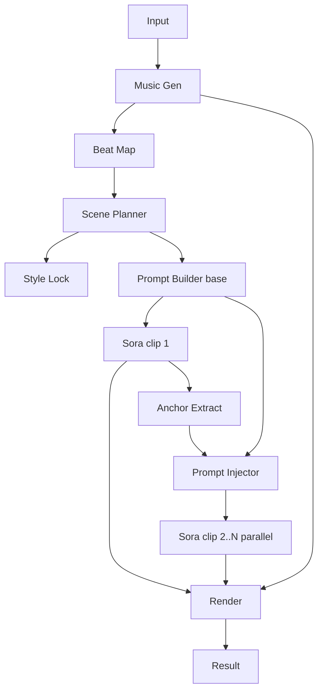

# 전략: 오디오-우선 + 앵커 주입 (mix_audio_anchor)

## 한줄 요약
음악을 먼저 확정하고, 1번 클립 앵커를 나머지 클립에 늦게 주입한다.

## 언제 쓰나
- 오디오 싱크가 매우 중요하지만, 순차 생성은 피하고 싶을 때

## 입력/출력
- 입력: prompt, pdf_paths, options, reference_audio(optional)
- 출력: 15초 클립 N개 + 최종 합성 mp4

### 입력 JSON 예시
```json
{
  "prompt": "사람 보이면 멈춰라 수칙을 요약해줘",
  "pdf_paths": ["input/v1.pdf", "input/v2.pdf"],
  "strategy": "mix_audio_anchor",
  "options": {"duration_seconds": 60, "mood": "tense"},
  "attachments": {"reference_audio": ["minio://refs/tempo_95bpm.wav"]}
}
```

## 입력 스키마 (JSON Schema)
```json
{
  "$schema": "https://json-schema.org/draft/2020-12/schema",
  "type": "object",
  "required": ["prompt", "pdf_paths", "strategy", "options"],
  "additionalProperties": false,
  "properties": {
    "prompt": { "type": "string", "minLength": 1 },
    "pdf_paths": { "type": "array", "items": { "type": "string" }, "minItems": 1 },
    "strategy": { "type": "string", "enum": ["mix_audio_anchor"] },
    "options": {
      "type": "object",
      "required": ["duration_seconds"],
      "additionalProperties": false,
      "properties": {
        "duration_seconds": { "type": "integer", "minimum": 30, "maximum": 90 },
        "mood": { "type": ["string", "null"] },
        "site_type": { "type": ["string", "null"] }
      }
    },
    "attachments": {
      "type": ["object", "null"],
      "additionalProperties": false,
      "properties": {
        "reference_images": { "type": "array", "items": { "type": "string" } },
        "reference_videos": { "type": "array", "items": { "type": "string" } },
        "reference_audio": { "type": "array", "items": { "type": "string" } }
      }
    }
  }
}
```

### 출력 메타 예시
```json
{
  "clips": ["minio://jobs/<job_id>/clip_01.mp4", "minio://jobs/<job_id>/clip_02.mp4"],
  "music": "minio://jobs/<job_id>/track_full.mp3",
  "final": "minio://jobs/<job_id>/final.mp4"
}
```

## 출력 스키마 (JSON Schema)
```json
{
  "$schema": "https://json-schema.org/draft/2020-12/schema",
  "type": "object",
  "required": ["clips", "music", "final"],
  "additionalProperties": false,
  "properties": {
    "clips": { "type": "array", "items": { "type": "string" } },
    "music": { "type": "string" },
    "final": { "type": "string" }
  }
}
```

## 처리 단계 (상세)
1) 음악 생성 → 비트 맵 추출
2) 씬 플래너 (타임코드 기준)
3) 스타일 락 생성
4) **클립1 생성**
5) 클립1 마지막 1~2초 앵커 추출
6) **나머지 클립 프롬프트에 앵커 주입**
7) 클립2..N 병렬 생성
8) 렌더 합성

## A/V 싱크 전략
- 음악 타임코드가 절대 기준.
- 클립 타임라인은 비트 맵에 고정.

## Sora 15초 제한 대응
- 15초 슬롯 기준. 병렬 생성은 앵커 주입 이후 수행.

## 실패/재시도 정책
- 클립1 실패 시 1회 재생성 후 진행
- 나머지 클립은 개별 재시도

## 에러/재시도 규칙표
| 단계 | 실패 조건 | 재시도 | 폴백 |
| --- | --- | --- | --- |
| 클립1 생성 | 길이/포맷 오류 | 1회 | 스타일 락만 유지 후 재생성 |
| 앵커 추출 | 앵커 불명확 | 1회 | 앵커 없이 병렬 진행 |
| 클립2..N | 실패/드리프트 | 1회 | 앵커 약화(포즈만 유지) |
| 음악 생성 | 실패/지연 | 1회 | 레퍼런스 오디오 사용 |

## LLM 프롬프트 템플릿
### 앵커 주입기
```text
역할: 프롬프트 리라이터
목표: base_prompt에 anchor를 주입
출력: updated_prompt
제약: 시작 1초 동안 anchor 포즈/구도 유지

base_prompt:
{BASE_PROMPT}
anchor:
{ANCHOR}
```

## 다이어그램

