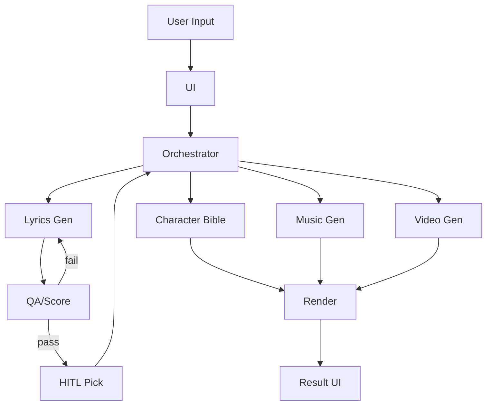

# 전략 원안 레퍼런스 (origin)

## 목적
- 팀이 수기로 정리한 초기 회로도(레퍼런스)를 보존한다.
- 실제 구현은 다른 전략 파일을 따른다.

## 핵심 흐름 요약
- UI → Orchestrator → 가사 생성/검수 → 캐릭터 바이블/음악/비디오 → 렌더
- QA 실패 시 1회 재생성 루프

## 입력/출력 스키마 (요약)
### 입력 (개념적)
```json
{
  "prompt": "string",
  "pdf_paths": ["input/v1.pdf"],
  "strategy": "origin",
  "options": { "duration_seconds": 60, "mood": "string", "site_type": "string" }
}
```

### 출력 (개념적)
```json
{
  "lyrics": ["string", "string"],
  "clips": ["clip_01.mp4"],
  "music": "track_full.mp3",
  "final": "final.mp4"
}
```

## 다이어그램


## 구현 메모
- 이 문서는 레퍼런스 목적.
- 실제 구현은 `strategies/*.md` 중 하나를 선택해 사용.
