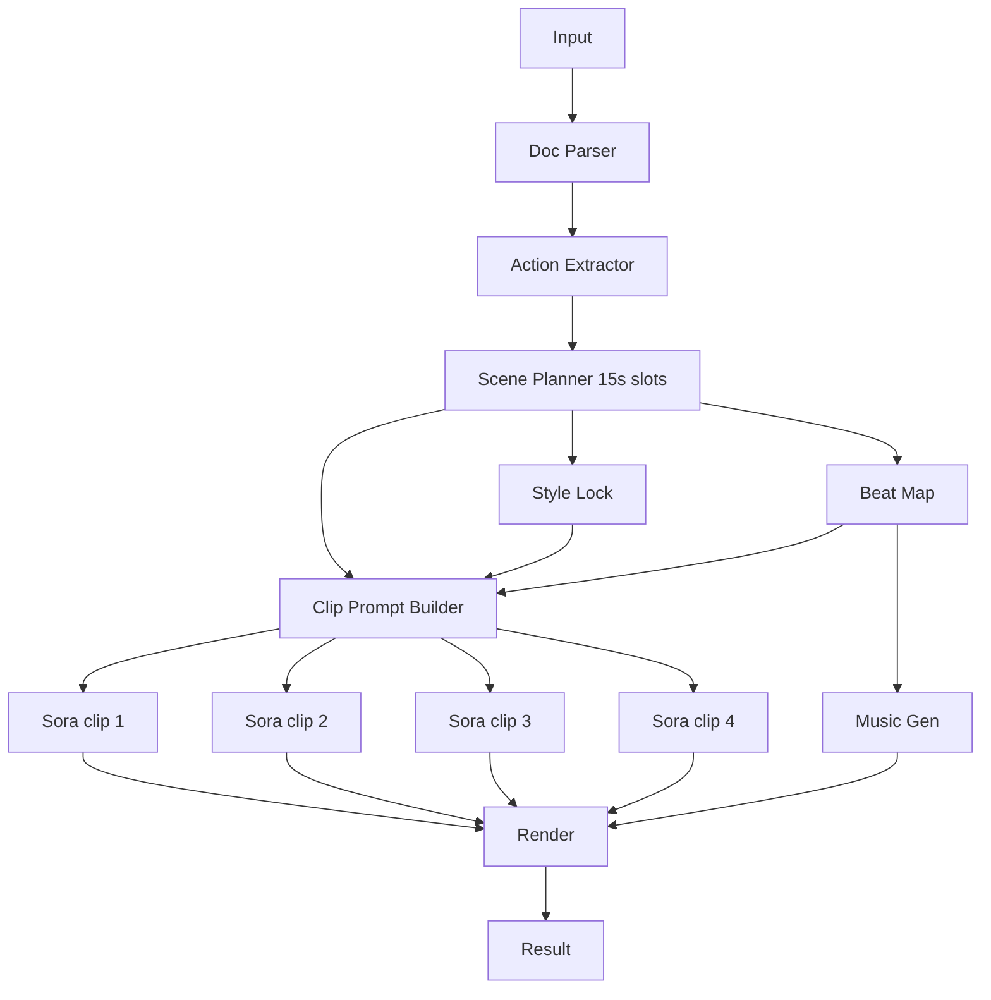

# 전략: 병렬 생성 + 스타일 락 (parallel_stylelock)

## 한줄 요약
15초 클립을 병렬로 생성하고, "스타일 락"으로 캐릭터·톤을 고정해 빠르게 완성한다.

## 언제 쓰나
- 속도가 중요할 때
- 전환이 약간 끊겨도 허용 가능한 데모

## 입력
- prompt: 텍스트 프롬프트(요약/요청)
- pdf_paths: 입력 PDF 파일 경로 리스트
- options: duration_seconds(30/60/90), mood, site_type
- attachments(선택):
  - reference_images: 캐릭터/복장/색감 고정용
  - reference_videos: 카메라 움직임/컷 리듬 참고
  - reference_audio: BPM/무드 추정용

### 입력 JSON 예시
```json
{
  "prompt": "지게차 안전 수칙을 힙합 MV로 요약해줘",
  "pdf_paths": ["input/v1.pdf", "input/v2.pdf"],
  "strategy": "parallel_stylelock",
  "options": {
    "duration_seconds": 60,
    "mood": "tense",
    "site_type": "warehouse"
  },
  "attachments": {
    "reference_images": ["minio://refs/helmet_style.png"],
    "reference_videos": ["minio://refs/camera_pan.mp4"],
    "reference_audio": ["minio://refs/hiphop_beat.wav"]
  }
}
```

## 입력 스키마 (JSON Schema)
```json
{
  "$schema": "https://json-schema.org/draft/2020-12/schema",
  "type": "object",
  "required": ["prompt", "pdf_paths", "strategy", "options"],
  "additionalProperties": false,
  "properties": {
    "prompt": { "type": "string", "minLength": 1 },
    "pdf_paths": { "type": "array", "items": { "type": "string" }, "minItems": 1 },
    "strategy": { "type": "string", "enum": ["parallel_stylelock"] },
    "options": {
      "type": "object",
      "required": ["duration_seconds"],
      "additionalProperties": false,
      "properties": {
        "duration_seconds": { "type": "integer", "minimum": 30, "maximum": 90 },
        "mood": { "type": ["string", "null"] },
        "site_type": { "type": ["string", "null"] }
      }
    },
    "attachments": {
      "type": ["object", "null"],
      "additionalProperties": false,
      "properties": {
        "reference_images": { "type": "array", "items": { "type": "string" } },
        "reference_videos": { "type": "array", "items": { "type": "string" } },
        "reference_audio": { "type": "array", "items": { "type": "string" } }
      }
    }
  }
}
```

## 출력
- clips: 15초 mp4 N개
- music: 전체 길이 mp3/wav 1개
- lyrics: 훅/벌스 텍스트
- final: 합성 mp4

### 출력 메타 예시
```json
{
  "clips": ["minio://jobs/<job_id>/clip_01.mp4"],
  "music": "minio://jobs/<job_id>/track_full.mp3",
  "final": "minio://jobs/<job_id>/final.mp4"
}
```

## 출력 스키마 (JSON Schema)
```json
{
  "$schema": "https://json-schema.org/draft/2020-12/schema",
  "type": "object",
  "required": ["clips", "music", "final"],
  "additionalProperties": false,
  "properties": {
    "clips": { "type": "array", "items": { "type": "string" } },
    "music": { "type": "string" },
    "final": { "type": "string" }
  }
}
```

## 처리 단계 (상세)
1) **문서 파싱**: 안전문서 → 문장 리스트
2) **행동 추출**: 문장 → 행동 규칙 리스트
3) **씬 플래닝**: 15초 슬롯에 행동 배치
4) **스타일 락 생성**: 캐릭터/복장/팔레트/조명/렌즈/카메라 규칙 고정
5) **비트 맵 생성**: BPM, 섹션(인트로/벌스/드랍) timecode 확정
6) **클립 프롬프트 생성**: 슬롯별 병렬 프롬프트 생성
7) **Sora 병렬 생성**: 15초 clip N개
8) **음악 생성**: 전체 길이 1개
9) **렌더**: 크로스페이드(0.3~0.7s)로 합치기

## A/V 싱크 전략
- **비트 맵 기준**으로 컷 시점을 고정.
- 클립별 timecode를 미리 확정하고, 렌더에서 해당 구간만 사용.

## Sora 15초 제한 대응
- 반드시 15초 단위로 생성하고 **렌더에서만 합치기**.

## 실패/재시도 정책
- 실패한 클립만 재시도 (최대 1~2회)
- 음악 실패 시 음악만 재생성
- 스타일 락은 재사용(일관성 유지)

## 에러/재시도 규칙표
| 단계 | 실패 조건 | 재시도 | 폴백 |
| --- | --- | --- | --- |
| 스타일 락 생성 | 규칙 누락/불명확 | 1회 | 레퍼런스 없이 기본 스타일로 고정 |
| 비트 맵 생성 | 타임코드 누락 | 1회 | 고정 BPM + 균등 분할 |
| 클립 생성 | 길이/포맷 오류 | 1~2회 | 해당 슬롯만 스틸 컷 + 크로스페이드 |
| 음악 생성 | 실패/지연 | 1회 | 레퍼런스 오디오로 대체 |
| 렌더 | 시간 불일치 | 1회 | 클립 트리밍 후 재합성 |

## LLM 프롬프트 템플릿 (OpenAI 기준)
### 1) 문서 파서
```text
역할: 안전문서 파서
목표: 입력 텍스트를 문장 배열로 분해
출력: sentences[] (원문 유지)

safety_text:
{SAFETY_TEXT}
```

### 2) 행동 추출기
```text
역할: 행동 규칙 추출기
목표: 문장을 행동 단위로 변환
출력: actions[] (동사 중심, 짧고 명확)
제약: 누락 금지, 중복 제거

sentences:
{SENTENCES_JSON}
```

### 3) 씬 플래너 (15초 슬롯)
```text
역할: 씬 플래너
목표: 15초 슬롯에 행동 배치
출력: scenes[] with timecode (0-15,15-30,...)

actions:
{ACTIONS_JSON}
duration_seconds:
{DURATION_SECONDS}
```

### 4) 스타일 락 생성
```text
역할: 스타일 락 생성기
목표: 캐릭터 외형/복장/색감/조명/렌즈/카메라 규칙을 고정
출력: style_lock (불변 규칙 명시)

mood:
{MOOD}
site_type:
{SITE_TYPE}
references:
{REFERENCE_IMAGES_SUMMARY}
```

### 5) 클립 프롬프트 빌더
```text
역할: Sora 프롬프트 작성기
목표: 15초 영상 프롬프트 생성
출력: clip_prompt
제약: style_lock 필수 포함, 카메라 룰 고정

scene:
{SCENE_JSON}
style_lock:
{STYLE_LOCK}
beat_map:
{BEAT_MAP}
```

## 다이어그램

