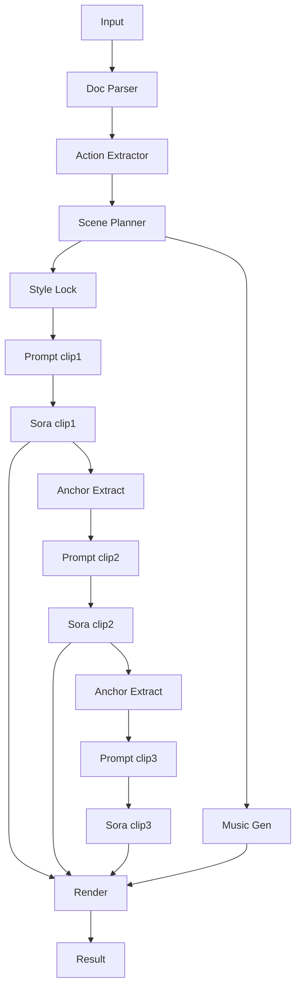

# 전략: 순차 앵커 (sequential_anchor)

## 한줄 요약
앞 클립의 마지막 프레임을 앵커로 삼아 다음 클립을 이어 붙인다.

## 언제 쓰나
- 전환 품질이 최우선일 때
- 속도보다 자연스러운 연결이 중요한 데모

## 입력/출력
- 입력: safety_text, options, attachments(레퍼런스)
- 출력: 15초 클립 N개 + 최종 합성 mp4

### 입력 JSON 예시
```json
{
  "safety_text": "작업 반경 내 접근 금지...",
  "strategy": "sequential_anchor",
  "options": {"duration_seconds": 60, "mood": "clear", "site_type": "warehouse"},
  "attachments": {"reference_images": ["minio://refs/worker.png"]}
}
```

## 입력 스키마 (JSON Schema)
```json
{
  "$schema": "https://json-schema.org/draft/2020-12/schema",
  "type": "object",
  "required": ["safety_text", "strategy", "options"],
  "additionalProperties": false,
  "properties": {
    "safety_text": { "type": "string", "minLength": 1 },
    "strategy": { "type": "string", "enum": ["sequential_anchor"] },
    "options": {
      "type": "object",
      "required": ["duration_seconds"],
      "additionalProperties": false,
      "properties": {
        "duration_seconds": { "type": "integer", "minimum": 30, "maximum": 90 },
        "mood": { "type": ["string", "null"] },
        "site_type": { "type": ["string", "null"] }
      }
    },
    "attachments": {
      "type": ["object", "null"],
      "additionalProperties": false,
      "properties": {
        "reference_images": { "type": "array", "items": { "type": "string" } },
        "reference_videos": { "type": "array", "items": { "type": "string" } },
        "reference_audio": { "type": "array", "items": { "type": "string" } }
      }
    }
  }
}
```

### 출력 메타 예시
```json
{
  "clips": ["minio://jobs/<job_id>/clip_01.mp4", "minio://jobs/<job_id>/clip_02.mp4"],
  "final": "minio://jobs/<job_id>/final.mp4"
}
```

## 출력 스키마 (JSON Schema)
```json
{
  "$schema": "https://json-schema.org/draft/2020-12/schema",
  "type": "object",
  "required": ["clips", "final"],
  "additionalProperties": false,
  "properties": {
    "clips": { "type": "array", "items": { "type": "string" } },
    "final": { "type": "string" }
  }
}
```

## 처리 단계 (상세)
1) 문서 파싱 → 행동 추출 → 씬 플래닝
2) 스타일 락 생성
3) **클립1 생성**
4) **앵커 추출**: 마지막 1~2초 구도/포즈/색감 요약
5) 앵커 포함 프롬프트로 클립2 생성
6) 반복
7) 음악 생성 → 렌더 합성

## A/V 싱크 전략
- **타임코드 고정** 후 순차 생성.
- 오디오는 전체 길이로 생성하고, 렌더에서 타임코드에 맞춰 합치기.

## Sora 15초 제한 대응
- 15초씩 순차 생성.

## 실패/재시도 정책
- 각 클립 1회 재시도 허용
- 앵커 품질이 낮으면 스타일 락만 사용해 프롬프트 재생성

## 에러/재시도 규칙표
| 단계 | 실패 조건 | 재시도 | 폴백 |
| --- | --- | --- | --- |
| 앵커 추출 | 포즈/구도 불명확 | 1회 | 앵커 없이 스타일 락만 사용 |
| 클립 생성 | 길이/포맷 오류 | 1회 | 이전 앵커 유지 후 재생성 |
| 음악 생성 | 실패/지연 | 1회 | 레퍼런스 오디오 사용 |
| 렌더 | 시간 불일치 | 1회 | 클립 트리밍 후 재합성 |

## LLM 프롬프트 템플릿
### 앵커 요약기
```text
역할: 앵커 요약기
목표: 마지막 1~2초의 구도/포즈/색감을 요약
출력: anchor

last_frames_description:
{LAST_FRAMES_DESCRIPTION}
```

### 클립 프롬프트 (앵커 포함)
```text
역할: Sora 프롬프트 작성기
목표: 15초 클립 생성
출력: clip_prompt
제약: 시작 1초 동안 앵커 포즈/구도를 유지

scene:
{SCENE_JSON}
style_lock:
{STYLE_LOCK}
anchor:
{ANCHOR}
```

## 다이어그램

