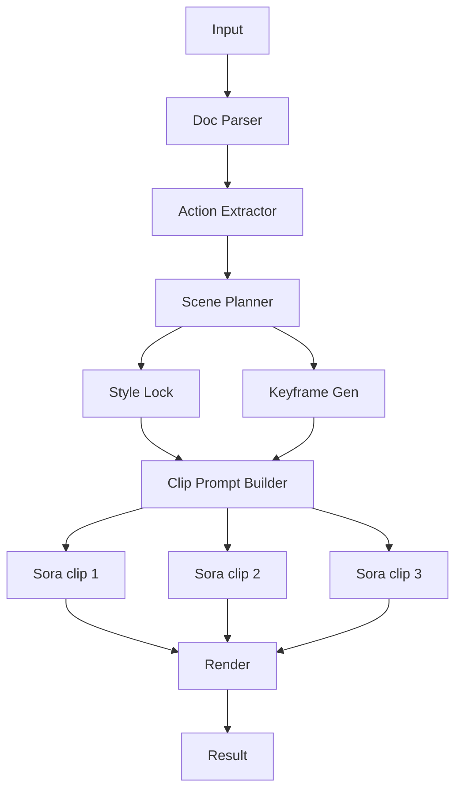

# 전략: 스토리보드 키프레임 (storyboard_keyframes)

## 한줄 요약
키프레임을 먼저 고정하고, 영상은 그 사이를 채우는 방식으로 일관성을 강화한다.

## 언제 쓰나
- 캐릭터/배경 일관성이 최우선일 때
- 추가 비용을 감수할 수 있을 때

## 입력/출력
- 입력: prompt, pdf_paths, options, reference_images(optional)
- 출력: 키프레임 이미지 + 15초 클립 N개 + 최종 합성 mp4

### 입력 JSON 예시
```json
{
  "prompt": "이상 소음 발생 시 중지 수칙을 요약해줘",
  "pdf_paths": ["input/v1.pdf", "input/v2.pdf"],
  "strategy": "storyboard_keyframes",
  "options": {"duration_seconds": 60, "mood": "clear"},
  "attachments": {"reference_images": ["minio://refs/warehouse_palette.png"]}
}
```

## 입력 스키마 (JSON Schema)
```json
{
  "$schema": "https://json-schema.org/draft/2020-12/schema",
  "type": "object",
  "required": ["prompt", "pdf_paths", "strategy", "options"],
  "additionalProperties": false,
  "properties": {
    "prompt": { "type": "string", "minLength": 1 },
    "pdf_paths": { "type": "array", "items": { "type": "string" }, "minItems": 1 },
    "strategy": { "type": "string", "enum": ["storyboard_keyframes"] },
    "options": {
      "type": "object",
      "required": ["duration_seconds"],
      "additionalProperties": false,
      "properties": {
        "duration_seconds": { "type": "integer", "minimum": 30, "maximum": 90 },
        "mood": { "type": ["string", "null"] },
        "site_type": { "type": ["string", "null"] }
      }
    },
    "attachments": {
      "type": ["object", "null"],
      "additionalProperties": false,
      "properties": {
        "reference_images": { "type": "array", "items": { "type": "string" } },
        "reference_videos": { "type": "array", "items": { "type": "string" } },
        "reference_audio": { "type": "array", "items": { "type": "string" } }
      }
    }
  }
}
```

### 출력 메타 예시
```json
{
  "keyframes": ["minio://jobs/<job_id>/kf_01.png"],
  "clips": ["minio://jobs/<job_id>/clip_01.mp4"],
  "final": "minio://jobs/<job_id>/final.mp4"
}
```

## 출력 스키마 (JSON Schema)
```json
{
  "$schema": "https://json-schema.org/draft/2020-12/schema",
  "type": "object",
  "required": ["keyframes", "clips", "final"],
  "additionalProperties": false,
  "properties": {
    "keyframes": { "type": "array", "items": { "type": "string" } },
    "clips": { "type": "array", "items": { "type": "string" } },
    "final": { "type": "string" }
  }
}
```

## 처리 단계 (상세)
1) 문서 파싱 → 행동 추출 → 씬 플래닝
2) 스타일 락 생성
3) **키프레임 생성** (5~7초 간격)
4) 키프레임 포함 클립 프롬프트 생성
5) Sora 병렬 생성
6) 렌더 합성

## A/V 싱크 전략
- 비트 맵 기반 timecode를 키프레임 위치와 정렬.

## Sora 15초 제한 대응
- 15초 슬롯 기준으로 영상 생성.

## 실패/재시도 정책
- 키프레임 단위 재시도 (클립 전체 재생성 방지)
- 키프레임 품질이 낮으면 스타일 락/참조 이미지로 보정

## 에러/재시도 규칙표
| 단계 | 실패 조건 | 재시도 | 폴백 |
| --- | --- | --- | --- |
| 키프레임 생성 | 인물/구도 불명확 | 1~2회 | 레퍼런스 이미지 고정 |
| 클립 생성 | 키프레임 미스매치 | 1회 | 키프레임 재생성 |
| 렌더 | 길이 불일치 | 1회 | 클립 트리밍 후 재합성 |

## LLM 프롬프트 템플릿
### 키프레임 프롬프트
```text
역할: 키프레임 디자이너
목표: 씬의 대표 프레임 생성
출력: keyframe_prompt
제약: 카메라 고정, 캐릭터 포즈 명확

scene:
{SCENE_JSON}
style_lock:
{STYLE_LOCK}
```

### 클립 프롬프트 (키프레임 포함)
```text
역할: Sora 프롬프트 작성기
목표: 키프레임 사이를 자연스럽게 연결하는 영상 생성
출력: clip_prompt
제약: 시작/중간/끝 포즈를 keyframe에 맞춤

scene:
{SCENE_JSON}
style_lock:
{STYLE_LOCK}
keyframes:
{KEYFRAMES}
```

## 다이어그램

