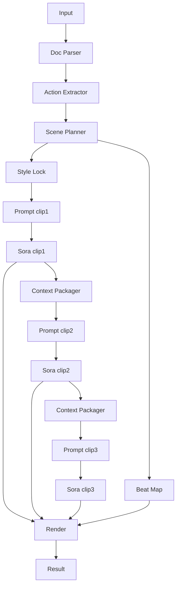

# 전략: 비디오 체인 (video_chain)

## 한줄 요약
이전 클립을 다음 클립 생성의 컨텍스트로 붙여서 가장 자연스럽게 이어간다.

## 언제 쓰나
- 연속성이 최우선인 시연
- 속도/비용보다 품질이 중요한 경우

## 입력/출력
- 입력: prompt, pdf_paths, options, reference_media(optional)
- 출력: 15초 클립 N개 + 최종 합성 mp4

### 입력 JSON 예시
```json
{
  "prompt": "화물 고정 이동 수칙을 요약해줘",
  "pdf_paths": ["input/v1.pdf", "input/v2.pdf"],
  "strategy": "video_chain",
  "options": {"duration_seconds": 60, "mood": "cinematic"},
  "attachments": {"reference_videos": ["minio://refs/camera_follow.mp4"]}
}
```

## 입력 스키마 (JSON Schema)
```json
{
  "$schema": "https://json-schema.org/draft/2020-12/schema",
  "type": "object",
  "required": ["prompt", "pdf_paths", "strategy", "options"],
  "additionalProperties": false,
  "properties": {
    "prompt": { "type": "string", "minLength": 1 },
    "pdf_paths": { "type": "array", "items": { "type": "string" }, "minItems": 1 },
    "strategy": { "type": "string", "enum": ["video_chain"] },
    "options": {
      "type": "object",
      "required": ["duration_seconds"],
      "additionalProperties": false,
      "properties": {
        "duration_seconds": { "type": "integer", "minimum": 30, "maximum": 90 },
        "mood": { "type": ["string", "null"] },
        "site_type": { "type": ["string", "null"] }
      }
    },
    "attachments": {
      "type": ["object", "null"],
      "additionalProperties": false,
      "properties": {
        "reference_images": { "type": "array", "items": { "type": "string" } },
        "reference_videos": { "type": "array", "items": { "type": "string" } },
        "reference_audio": { "type": "array", "items": { "type": "string" } }
      }
    }
  }
}
```

### 출력 메타 예시
```json
{
  "clips": ["minio://jobs/<job_id>/clip_01.mp4", "minio://jobs/<job_id>/clip_02.mp4"],
  "final": "minio://jobs/<job_id>/final.mp4"
}
```

## 출력 스키마 (JSON Schema)
```json
{
  "$schema": "https://json-schema.org/draft/2020-12/schema",
  "type": "object",
  "required": ["clips", "final"],
  "additionalProperties": false,
  "properties": {
    "clips": { "type": "array", "items": { "type": "string" } },
    "final": { "type": "string" }
  }
}
```

## 처리 단계 (상세)
1) 문서 파싱 → 행동 추출 → 씬 플래닝
2) 스타일 락 + 비트 맵
3) 클립1 생성
4) 클립1 마지막 2~3초를 **컨텍스트로 첨부**
5) 클립2 생성
6) 반복
7) 렌더 합성

## A/V 싱크 전략
- 전체 오디오를 먼저 생성하고 timecode에 맞춰 각 클립을 배치.

## Sora 15초 제한 대응
- 순차 15초 생성.

## 실패/재시도 정책
- 각 클립 생성 후 품질 게이트(길이/시각 품질/싱크 확인)
- 실패 시 해당 클립만 재시도 (최대 1회)

## 에러/재시도 규칙표
| 단계 | 실패 조건 | 재시도 | 폴백 |
| --- | --- | --- | --- |
| 컨텍스트 패키징 | 이전 클립 요약 불명확 | 1회 | 마지막 1초 스틸로 대체 |
| 클립 생성 | 길이/포맷 오류 | 1회 | 스타일 락 강화 후 재생성 |
| 렌더 | 시간 불일치 | 1회 | 클립 트리밍 후 재합성 |

## LLM 프롬프트 템플릿
### 컨텍스트 요약기
```text
역할: 컨텍스트 요약기
목표: 이전 클립의 마지막 2~3초 핵심 구도/움직임 요약
출력: context

prev_clip_summary:
{PREV_CLIP_SUMMARY}
```

### 체인 클립 프롬프트
```text
역할: Sora 프롬프트 작성기
목표: 이전 클립에서 자연스럽게 이어지는 15초 클립 생성
출력: clip_prompt
제약: 시작 1~2초는 이전 클립과 시각적으로 연속

scene:
{SCENE_JSON}
style_lock:
{STYLE_LOCK}
context:
{CONTEXT}
```

## 다이어그램

